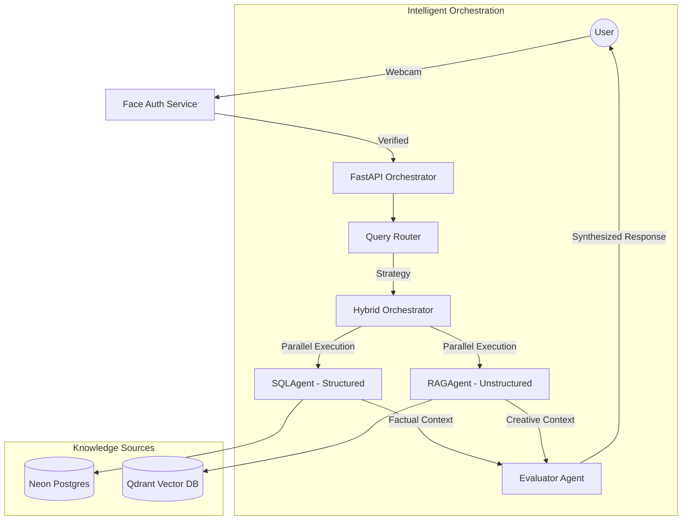

# System Architecture: Nexus Core

This document outlines the architectural decisions, data flow, and multi-agent design of the **Nexus Core**—an Intelligent Hybrid RAG Interviewer for Video Game Character Design.

## 1. High-Level Overview

Nexus Core is built on a **Modular Multi-Agent Architecture** designed to bridge the gap between structured relational data (PostgreSQL) and unstructured narrative knowledge (Vector DB).

## 2. Key Architectural Decisions

### 2.1 Biometric Identity Verification
- **Technology**: Utilizes `InsightFace` (Buffalo_L) power by the `ONNX Runtime` for high-performance facial feature extraction.
- **Security**: Unlike simple face detection, the system performs **Identity Verification** by comparing real-time facial embeddings against a stored user template using Cosine Similarity (Threshold: 0.78).
- **Liveness**: Implements a **Full-Sequence Liveness Scanner** that analyzes the 2-second capture window for natural motion (blinks/head turns) to prevent spoofing with static photos.

### 2.2 Hybrid Query Routing
The system uses an intelligent **Query Router** to optimize token usage and latency:
- **Structured Mode**: Triggered by technical keywords (stats, genres, constraints).
- **Unstructured Mode**: Triggered by creative keywords (lore, narrative, style).
- **Hybrid Mode**: Triggered by complex design queries (e.g., "Optimize a Rogue for my mobile constraints"). The system then invokes both agents and the Evaluator.

### 2.3 Multi-Agent Coordination
- **SQLAgent**: Accesses the Neon Postgres database to retrieve production-grade constraints (Memory budgets, Polycounts, Genre standards).
- **RAGAgent**: Performs semantic search on Qdrant to retrieve qualitative character design theory from PDF documentation.
- **EvaluatorAgent**: Acts as the "Senior Lead Designer." It receives inputs from both agents in parallel, detects conflicts (e.g., if a creative idea exceeds the polycount budget), and synthesizes a cohesive response.

## 3. Performance Engineering
- **Asynchronous Execution**: Agents are executed in parallel using `asyncio.gather` to ensure response times remain under the 5-second production budget.
- **SSE Streaming**: Implements Server-Sent Events (SSE) with a specialized **Multi-Agent Reasoning (Thoughts)** log. This allows the user to see the internal "Thinking" process of the agents, improving perceived latency.
- **Token Optimization**: Utilizes `Gemini-1.5-Flash` for its high efficiency and context-window intelligence, ensuring minimal costs while maintaining high reasoning quality.

## 4. Separation of Concerns
The codebase follows a strictly modular folder hierarchy:
- `/api`: REST and SSE endpoints.
- `/agents`: Independent AI personalities (SQL, RAG, Evaluator).
- `/services`: Core business logic (Auth, Ingestion, Retrieval).
- `/orchestration`: Logic for coordinating multi-agent steps.
- `/db`: Database schemas, repositories, and session management.
- `/core`: Global configuration and client initializations.
